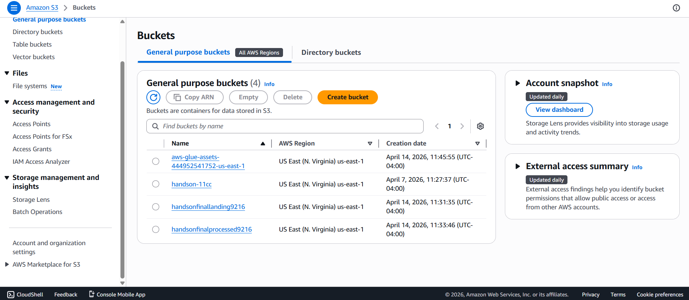
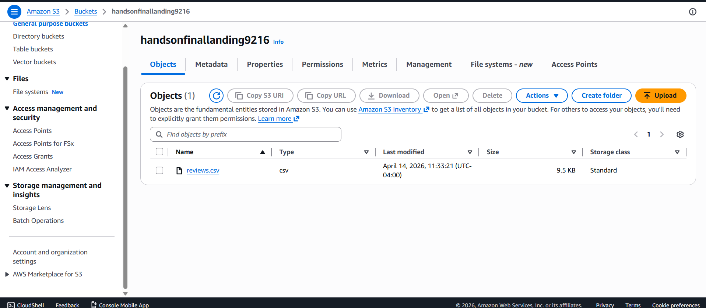
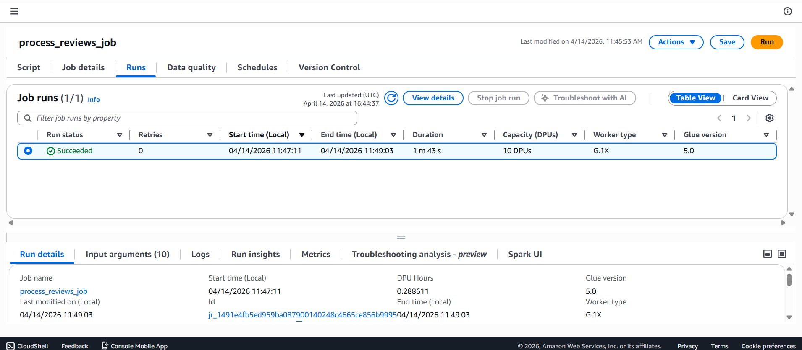
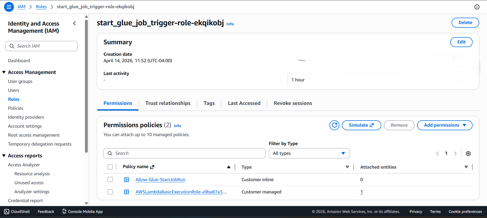
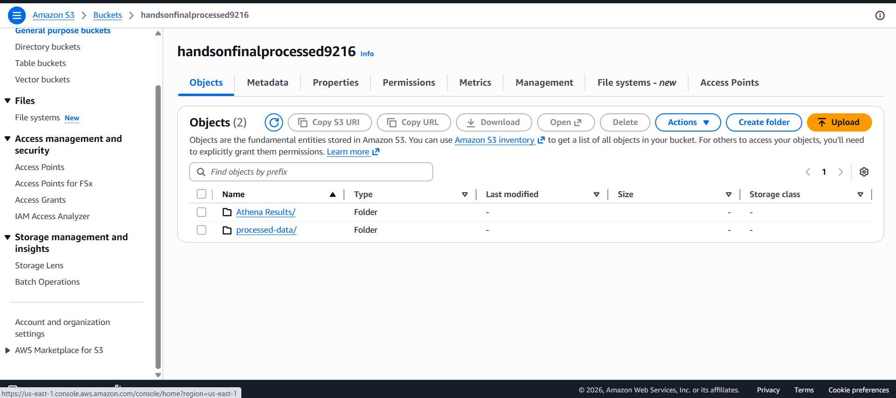
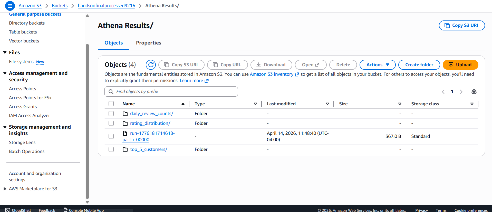
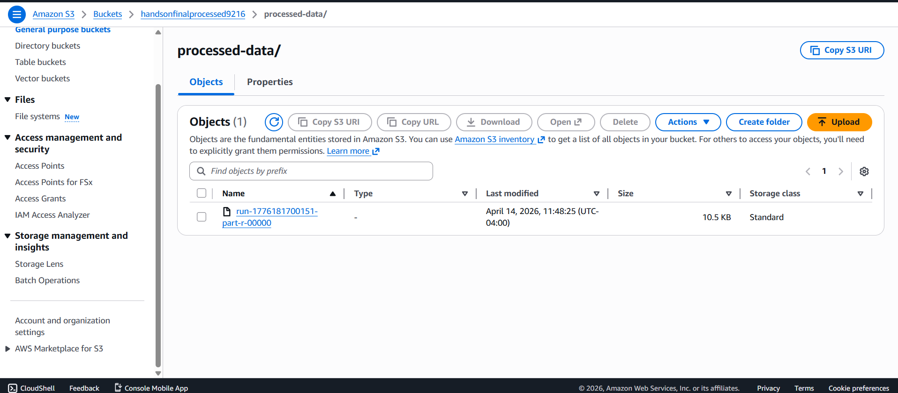

# Hands-On 12: Serverless Spark ETL Pipeline on AWS

## 📊 Project Overview

This project implements a fully automated, event-driven serverless data pipeline on AWS. It demonstrates the modern approach to Data Engineering without the need to manually execute scripts.

The pipeline automatically ingests raw CSV product review data, processes it using a Spark ETL job, runs consecutive analytical SQL queries on the data, and saves both the cleaned dataset and the aggregated results back into isolated S3 paths.

---

## 🏗️ Architecture & Data Flow

**Data Flow Pipeline:**
`S3 (Landing Upload) -> Lambda (S3 Event Trigger) -> AWS Glue (PySpark ETL Job) -> S3 (Processed Results & Analytics)`

1. A raw `reviews.csv` file is uploaded to the landing S3 bucket.
2. The `s3:ObjectCreated:*` event triggers an **AWS Lambda** function.
3. The Lambda function acts as a driver to trigger the **AWS Glue ETL job**.
4. The Glue job (PySpark) reads the CSV, cleans it, handles missing values, standardized product IDs, and runs multiple Spark SQL queries.
5. The processed dataset and analytical queries are written out as `.csv` artifacts into the processed S3 bucket.

---

## 🛠️ Technology Stack & AWS Resources Used

### 1. Data Lake: Amazon S3
The central storage layer hosting isolated landing and processing zones.
* **Landing Bucket:** `s3://handsonfinallanding9216/`
* **Processed Bucket:** `s3://handsonfinalprocessed9216/`

**S3 Buckets Configuration:**

**Raw data (`reviews.csv`) uploaded to Landing Zone:**

### 2. ETL (Spark): AWS Glue
A serverless Spark execution environment running the `process_reviews_job` ETL script to transform and aggregate data.

**Glue Job Successful UI Execution Log:**

### 3. Serverless Compute: AWS Lambda & IAM
AWS Lambda (Function: `start_glue_job_trigger`) monitors the S3 landing bucket and automatically kicks off the Glue Job securely via IAM roles.

**IAM Execution Role for Lambda & Glue trigger:**

---

## ⚙️ Spark SQL Queries Implemented

Inside the AWS Glue Spark Session, the following data analytics queries were developed and executed dynamically:

1. **Average Rating & Review Count per Product:**
   Aggregates average ratings and review counts grouping by the standardized `product_id`.
2. **Date-wise Review Count:** 
   Calculates the total number of reviews submitted per day showing trends over time.
3. **Top 5 Most Active Customers:** 
   Identifies platform "power users" by showing the customers with the highest amount of submissions along with their average given ratings.
4. **Overall Rating Distribution:** 
   Displays a count and percentage breakdown for each star rating tier (1 to 5 stars).

---

## 🚀 Execution & Results

The pipeline successfully executed on the AWS Cloud. The resulting output data files have been downloaded and saved locally in the `Outputs/` directory of this repository, while the master copies live securely in the processed S3 bucket.

### Processed Output in S3 Bucket:

**Folders partitioned for Data and Athena Analysis:**

**Analytical Query Outputs (Athena Results):**

**Cleaned Transactional Dataset (`processed-data`):**

### Local Output Files Reference:
* **Cleaned Full Dataset:** `Outputs/run-1776181700151-part-r-00000Cleaned_Dataset`
* **Average Ratings by Product:** `Outputs/run-1776181714618-part-r-00000`
* **Daily Review Counts:** `Outputs/run-1776181722415-part-r-00000 Daily_Review Counts`
* **Top 5 Customers:** `Outputs/run-1776181725400-part-r-00000Top_5Customers`
* **Rating Distribution:** `Outputs/run-1776181730683-part-r-00000Rating_Distribution`
